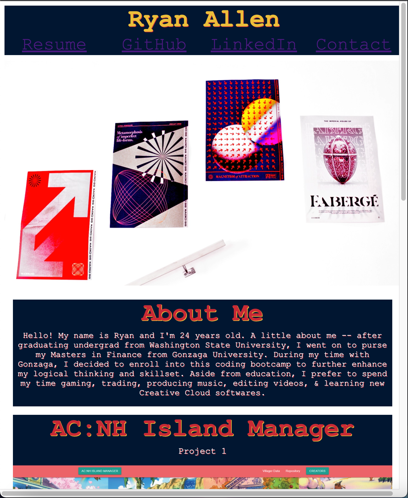
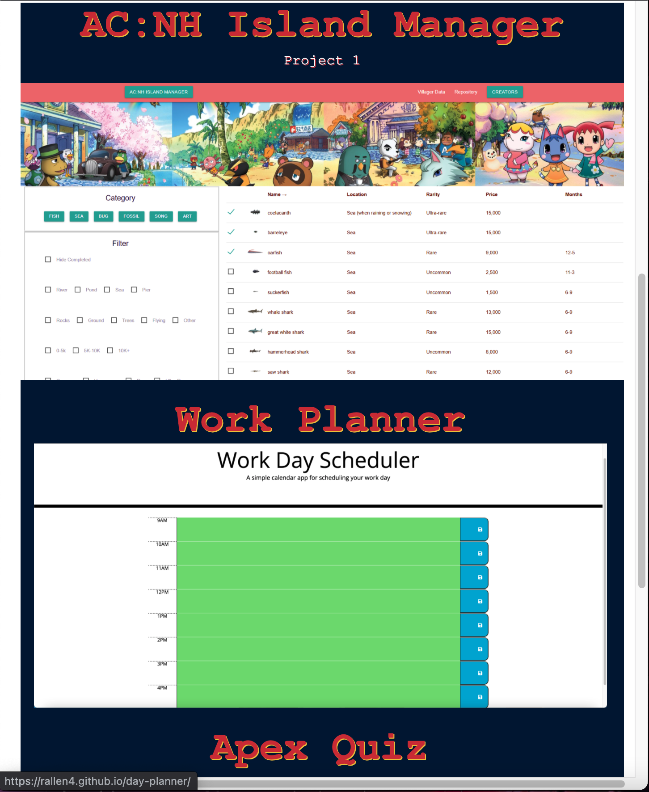

# Portfolio

## About This Project:

#Portfolio is a website that consists of a composition of both HTML and Advanced CSS. For design purposes, I built my website around projects I have built and photography I have taken.

# Functionality:
    ## - Each picture (following the "About Me" section) is linked to a deployed site that displays the project/homework that the displayed picture represents
       - Navbar links at the top take the user to the descriptors live site. 
       - Site is functional in mobile mode and flexes to display optimal sizing per the users viewport size.
       - Header picture is my own photography, while other pictures are screenshots of previous work. 
       - The framework is original and NOT Bootstrap, Materialize, or other. 

# Homework's & Projects
## I chose my Project 1, Day Planner & Code Quiz homework to display due to their functionalities and "most professional" displays. While I intend to update/change these selections in the future when I have more impressive work to display, for now, these are satisfactory to me. 

# Live Site: 
## https://rallen4.github.io/portfolio/

# Repository: 
## https://github.com/Rallen4/portfolio

