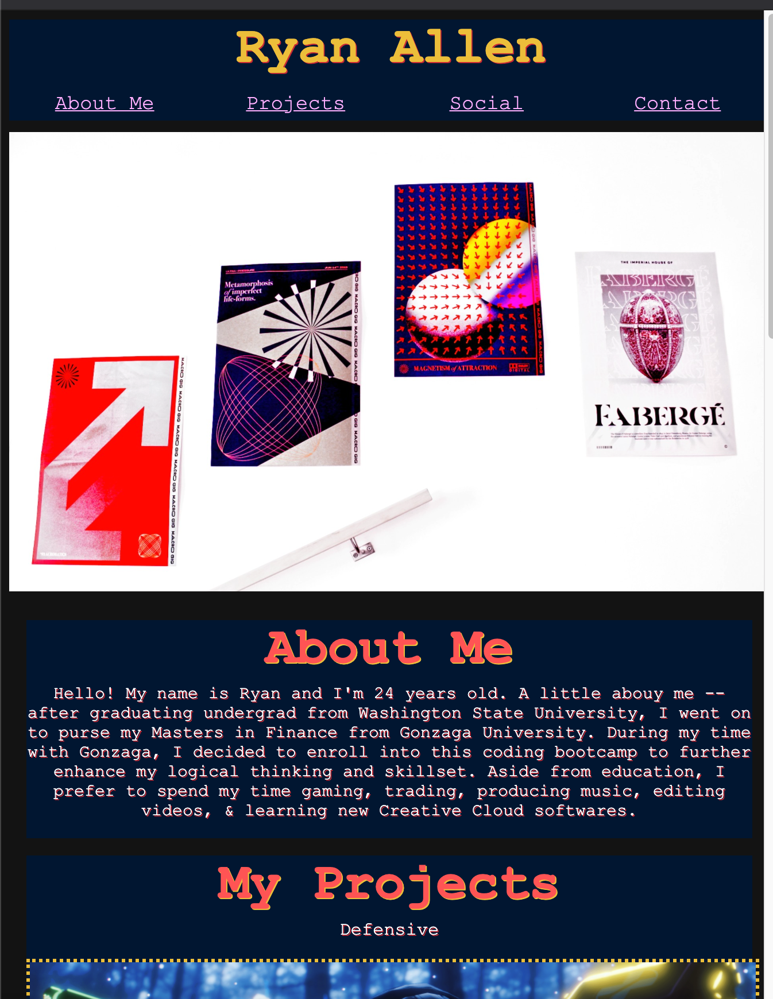
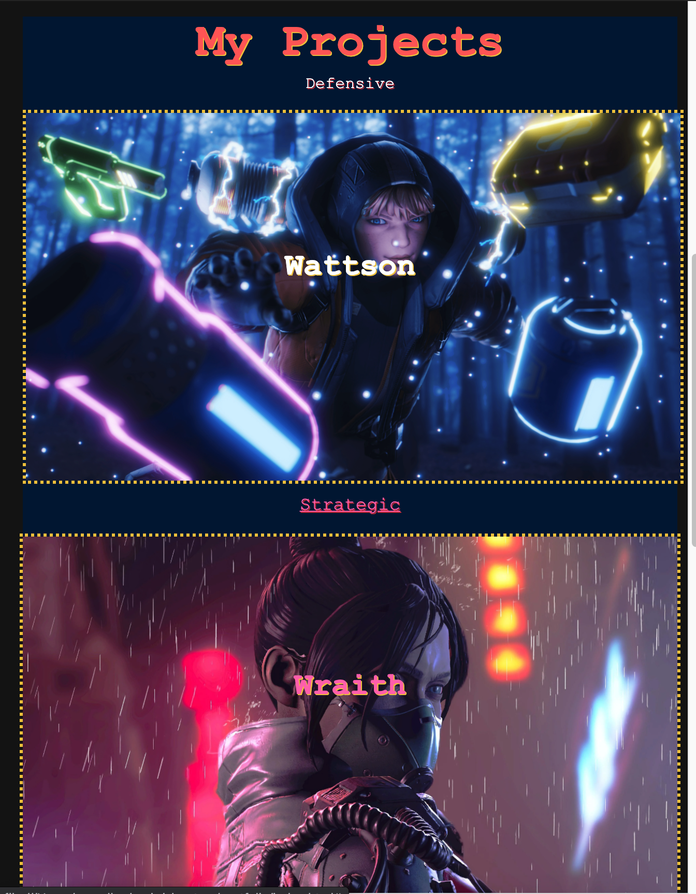
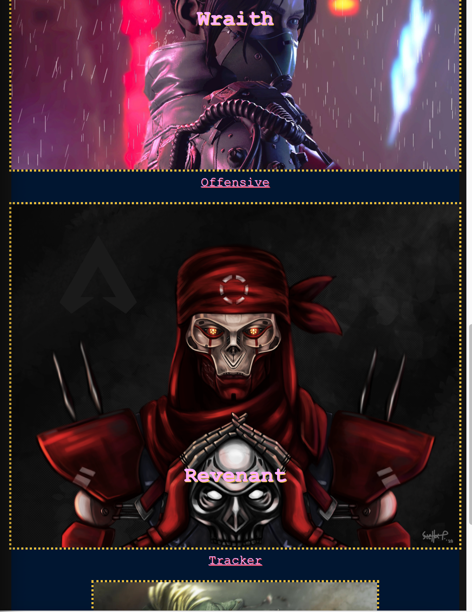
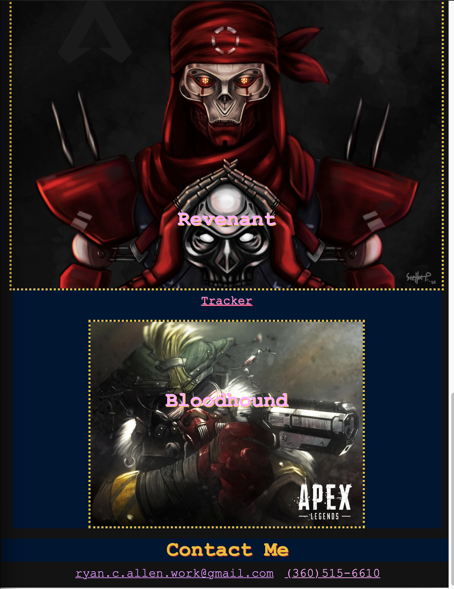

# Portfolio

## About This Project

#Portfolio is a website that consists of a composition of both HTML and Advanced CSS. For design purposes, I built my website around the FPS game: Apex Legends. 

    My purpose for using a gaming theme revolves around my intent of applying to companies such as Twitch. I would like to portray my ability to both graphically design on the front end and web design on the back end. 

 This project's purpose was for us to build our first landing -- a page that features not only ourselves as candiates, but also our ability to use a variety of Advanced CSS programming tools that help feature a more "user-engaging" version of a website. 

    - By user engaging, I mean "interactive."
        - For example, the <nav> bar in the header has 4 individual links attached to the 4 individual key words (i.e."Social" links to my Instagram page).
        - The aspect ratio of the screen also adapts to changing screen sizes and devices (i.e. the screen fits both mobile and desktop devices without distortion of view or context.)

## What I Learned

I learned a signficant amount about how to use tags and headers effectively and efficiently to optimize workflow and accessibility. There were many times when I would write redundant CSS code, only to realize I could completely eliminate numerous lines of code simply by linking a particular <section class="header"> semantic tag to my HTML and then addressing that same header tag within my CSS.

I also learned a fair amount about design from the eyes of the programmer. Preset "Build Your Own Website" apps and developer services allows the user to focus on creative development, but projects like THIS ONE where we were responsible for writing both the context code & corresponding styling code made for a satisfying creative challenge. 

    While my website is no where close to my "creative dream," given the amount of work it took to simply build that specific design, I am happy with the outcome (minus the coding errors). 

## Challenges Faced

Building this website brought many challenges. I was unable to get my flexbox code to operate correctly and thus, I was left with a website that DOES adapt to changing screen sizes, but DOES NOT feature the images as moving elements around one another. I also was unable to get my sidebars to act as "sidebars" and not "headers." I believe my orientation settings were incorrect and thus, my boxes were centering and not <floating: left>. 

## Screenshots of Website Below

